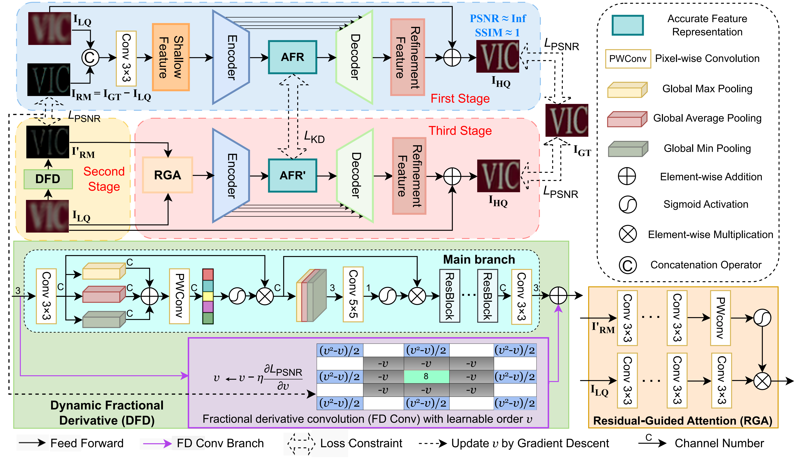

# 3SDeblur: Three-Stage Image Defocus Deblurring Guided by Residual Prior

[](https://link.springer.com/chapter/10.1007/978-981-95-4378-6_6)
[](https://github.com/lizhangray/3SDeblur)

Official PyTorch implementation of the paper:  
**"3SDeblur: Three-Stage Image Defocus Deblurring Guided by Residual Prior"**  
*Yihang Chen, Zhan Li, Boyang Yao, Xiaohan Li, Wenzhuo Wang, Qingliang Chen*  
Department of Computer Science, Jinan University

---


## 📖 Abstract
> As a typical low-level vision task, single image defocus deblurring aims to produce a sharp clear image from a defocused blurry image. However, image degradation inevitably results in a significant loss of information and non-uniqueness of the solution, making it challenging to learn the mapping from low-quality inputs to high-quality outputs. To address this issue, we propose a three-stage learning framework for image defocus deblurring, namely 3SDeblur, which consists of stages for accurate feature extraction, residual prior estimation, and image restoration. First, the solution space is constrained by applying identity mapping to all-in-focus images, to extract an accurate feature representation (AFR) of ground truth images. Second, a dynamic fractional derivative network is designed to estimate residual maps as a prior to compensate for the lost details caused by the defocus blurring. Finally, we propose a residual-guided attention module to aggregate the defocused image and residual map. Under the guidance of AFR and residual priors, a sharp image is restored. Extensive experiments demonstrate that our 3SDeblur achieves superior performance on defocus deblurring, especially a significant improvement of 0.81 dB in PSNR on the LFDOF dataset, compared to state-of-the-art methods.
---

## Framework



## 🛠 Installation

```
python 3.9.5
pytorch 1.11.0
cuda 12.2
```

```bash
git clone https://github.com/lizhangray/3SDeblur.git
cd 3SDeblur
pip install -r requirements.txt
python setup.py develop --no_cuda_ext
``` 


## Evaluation

### Download Test Dataset
DownLoad the LFDOF dataset from <u>[AIFNet](https://sweb.cityu.edu.hk/miullam/AIFNET/)</u> and DPDD dataset from <u>[DPDNet](https://github.com/Abdullah-Abuolaim/defocus-deblurring-dual-pixel?tab=readme-ov-file)</u>.

### Pretrain_Model
Download the <u>[Pre-trained Model](https://drive.google.com/drive/folders/1EPFQRlTnoNYVEQ03xzYc5kDROkklAlNo?usp=sharing)</u> in `pretrain_model`

### Test
Example usage to perform Defocus Deblurring on LFDOF dataset:
```bash
torchrun --nproc_per_node=1 --master_port=4321  basicsr/test.py -opt options/test/LFDOF/LFDOF.yml --launcher pytorch
```
Example usage to perform Defocus Deblurring on DPDD dataset:
```bash
torchrun --nproc_per_node=1 --master_port=4321  basicsr/test.py -opt options/test/LFDOF/DPDD.yml --launcher pytorch
```

## 🎯 Results

### Quantitative Comparison on LFDOF Dataset


| Method | PSNR↑ | SSIM↑ | LPIPS↓ | 
|--------|--------------|---------------|---------------|
| NAFNet*  | 30.52 | 0.882 | 0.163 |
| Restormer*  | 29.83 | 0.880 | 0.151 |
| INIKNet | 30.29 | 0.886 | 0.132 |
| NRKNet  | 30.48 | 0.884 | 0.147 |
| ViTDeblur  | 30.52 | 0.892 | 0.144 |
| DocRes*  | 29.86 | 0.873 | 0.163 |
| **3SDeblur** | **31.33** | **0.896** | **0.127** |

### Quantitative Comparison on DPDD Dataset

| Method | PSNR↑ | SSIM↑ | LPIPS↓ |
|--------|-------|-------|--------|
| DRBNet | 25.72 | 0.803 | 0.185 |
| NAFNet* | 25.39 | 0.846 | 0.199 |
| Restormer* | 25.98 | 0.811 | 0.178 |
| INIKNet | 26.06 | 0.803 | 0.185 |
| NRKNet | 26.11 | 0.810 | 0.210 |
| ViTDeblur | 26.11 | 0.814 | 0.201 |
| DocRes* | 25.61 | 0.796 | 0.246 |
| **3SDeblur** | **26.09** | **0.866** | **0.131** |
---

### Visual Results
[LFDOF Results](https://drive.google.com/drive/folders/1whycpa0nLo4zVUg6s9h5Di9ZkOF5Ua7i?usp=sharing)

## Citations
```angular2html
@inproceedings{
author = {Chen, Yihang and Li, Zhan and Yao, Boyang and Li, Xiaohan and Wang, Wenzhuo and Chen, Qingliang},
title = {3SDeblur: Three-Stage Image Defocus Deblurring Guided by Residual Prior},
year = {2025},
publisher = {Springer-Verlag},
booktitle = {Neural Information Processing: 32nd International Conference, ICONIP 2025, Okinawa, Japan, November 20–24, 2025, Proceedings, Part II},
pages = {77–91},
numpages = {15}
}
```
## Contact
- If you have any questions, please contact [ehang@stu.jnu.edu.cn](mailto:ehang@stu.jnu.edu.cn)
- Acknowledgment: This code is based on the [NAFNet](https://github.com/megvii-research/NAFNet) and [BasicSR](https://github.com/XPixelGroup/BasicSR) toolbox.